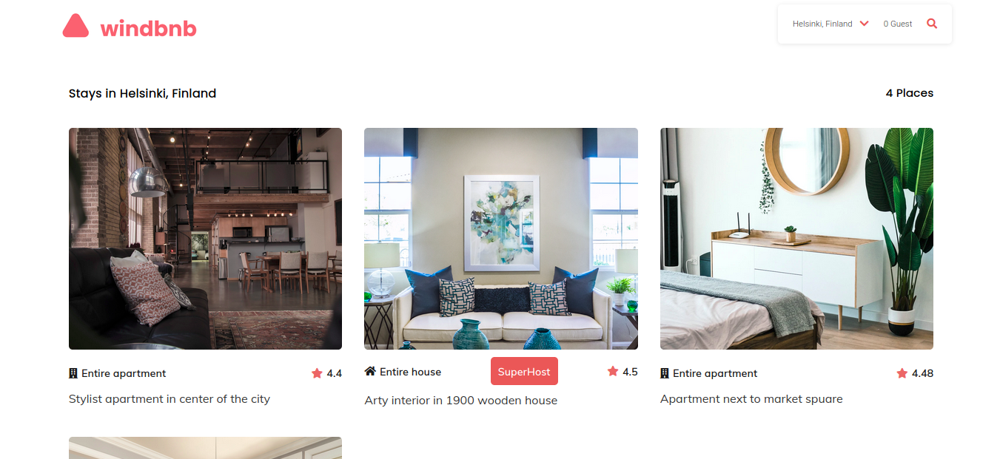
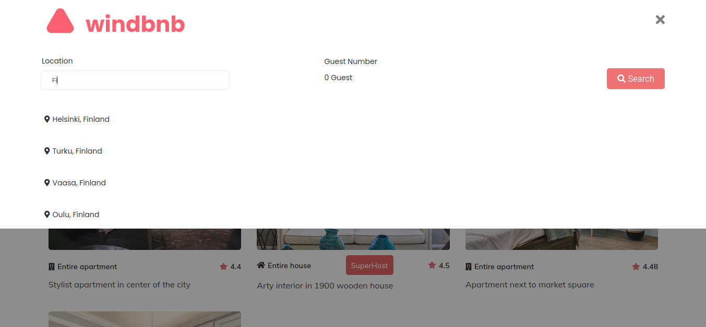
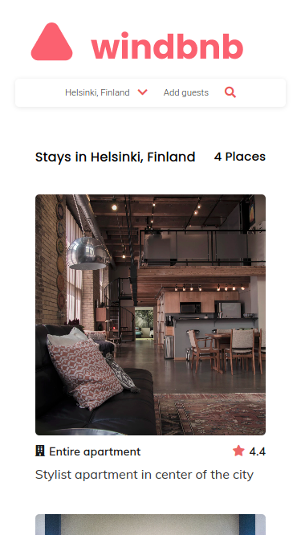
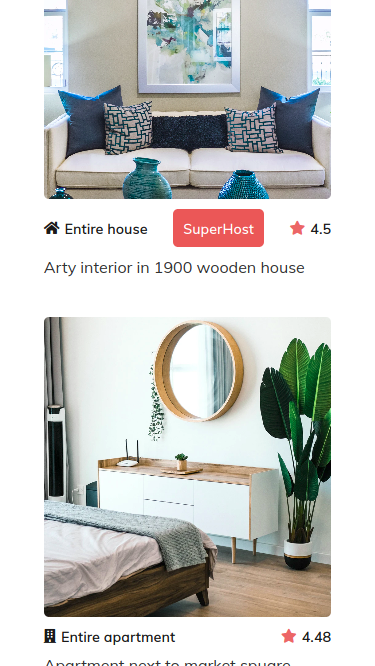

<!-- Please update value in the {}  -->

<h1 align="center"><a href="https://eufraniodiogo.github.io/windbnb">Windbnb</a></h1>

  <h3>
    <a href="https://eufraniodiogo.github.io/windbnb">
      Demo
    </a>
     | 
    <a href="https://github.com/EufranioDiogo/windbnb">
      Solution
    </a>
  </h3>

## Table of Contents

- [Table of Contents](#table-of-contents)
- [Overview](#overview)
  - [Built With](#built-with)
- [Contact](#contact)

## Overview

- Where can I see your demo? 
  [Here](https://eufraniodiogo.github.io/windbnb)
- What was your experience? 
  It was a very cool project to pratice and learn new stuff!
- What have you learned/improved? 
  More about Design.

### Built With

<!-- This section should list any major frameworks that you built your project using. Here are a few examples.-->

- Vue.js
- JS
- HTML
- CSS

## Contact

- [Website](https://eufraniodiogo.github.io)
- [GitHub](https://github.com/EufranioDiogo)
- Email: eufraniodiogo5@gmail.com
